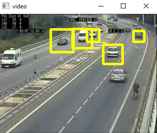

# Numpy/OpenCV Python Car Detection Program

## Description
For my learning purpose, I wanted to try system detection with Python. This will help me in the future for an better understanding of simple program.
This code will detect a car in a video, but we can probably add it to an camera. When there is an car's detection, a square will appear to the video
and show where is the car.

## Installation
Install the requirements.txt available in the repository.

### Librairies for the installation
- Opencv

